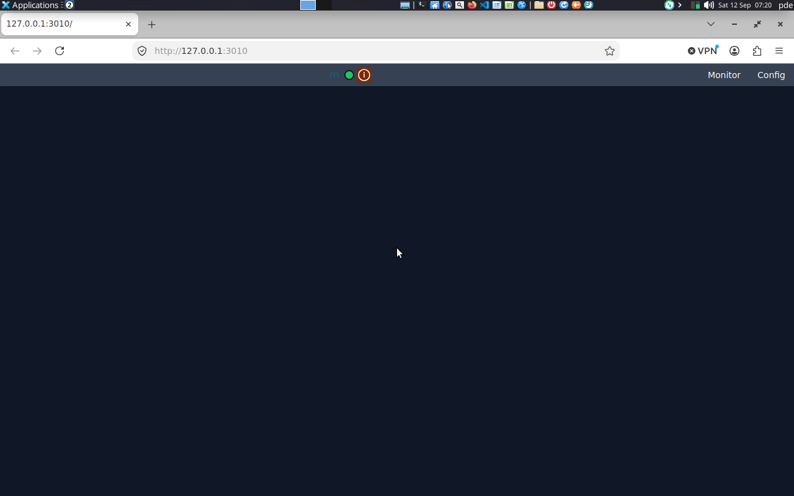

# Packaging: shipping rn as an installable app

rn is meant to be installed by users, not cloned by developers. That single fact
decides how Node is handled: **the app carries its own Node runtime and never
looks for one on the machine.**

This document covers what gets installed, why the runtime is private, the four
ways a user's existing Node can still interfere, and how to stop each one.

---

## 1. What gets installed

```
~/.local/share/rn/          # per-user, the default; /opt/rn system-wide (§8)
├── rn                      # Rust launcher — THE entry point the user runs
├── runtime/
│   ├── bin/node            # pinned private Node, invoked by absolute path
│   ├── LICENSE             # Node's MIT license — required for redistribution
│   └── VERSION
├── app/
│   ├── src/                # the be/ sources, run as TypeScript directly
│   ├── node_modules/       # npm ci at build time, shipped as-is (§3.4)
│   ├── web/                # the fe release bundle, served by the backend
│   ├── package.json        # and package-lock.json
│   ├── runtime-params.json # the parameter registry the launcher reads
│   └── .env.example        # which settings exist; a .env beside it is the user's
├── install.sh              # installs this tree, and later uninstalls it
└── BUILD                   # commit, date, Node version, anything left out
```

This is what `scripts/package.sh` builds (§11). It replaced a sketch that
listed a `config/defaults.env` nothing ever read and had no page at all. The
settings the user changes live in `app/.env`, which is the one file an upgrade
carries across, and in `~/.config/rn`, which the install never touches.

**The page is served by the backend.** In development `dx serve` serves the
frontend on its own port. An install has no dev server, so the API server
hands every GET that isn't an `/api` route to `be/src/web.ts`, which serves
`app/web/`. Page and API then share one origin. The bundle is built with
`RN_API_BASE=""`, so it asks for `/api/...` relative to wherever it was
loaded from, on whatever port the install uses, with no CORS involved. In
the repo there is no `be/web`, so nothing changes there: the backend logs
`"step":"web","served":false` at boot and the JSON 404 answers as before.

**The Rust launcher is the entry point, not a shell script.** It resolves its own
location, spawns Node from `runtime/bin/node` by absolute path, constructs the
child environment explicitly, supervises the process, and restarts it on crash.
A shell wrapper can do some of this, but it inherits the user's environment by
default — which is exactly the thing we're trying to prevent (§3).

**Why the launcher is Rust**: `CLAUDE.md` says Rust sits underneath where it's
reasonable. Process supervision, exact-path resolution, and a single dependency-
free binary that must run before Node exists is precisely that case — Node can't
bootstrap itself.

---

## 2. Why a private runtime

**Two Node binaries cannot conflict with each other.** Node has no shared
library, no global registry, no daemon, no shared runtime state. Two copies on
one machine are as independent as two copies of `grep`. The bundled runtime is
not a risk; relying on the *system's* runtime is.

Two things verified on this machine make the case:

**A user who "has Node" may have no Node your app can find.**

```bash
$ env -i bash -c 'command -v node'
NOT FOUND
```

This machine has Node 24.19.0. It's on PATH only because nvm's shell profile
puts it there. An app launched from a `.desktop` file, a systemd unit, or a GUI
double-click gets a clean environment and finds nothing. Version managers (nvm,
asdf, fnm) are shell-level; they don't exist for non-shell launches.

**Even with your own binary, the user's environment can stop it booting.**

```bash
$ NODE_OPTIONS="--require=/nonexistent/thing.js" node -e 'console.log("hi")'
node:internal/modules/cjs/loader:1520
  throw err;
exit=1
```

That's a user-set environment variable killing a process before your first line
of code runs. Bundling the binary does not fix this — see §3.

**The alternative — requiring a system Node — costs the user a manual install,
exposes you to every version between 18 and whatever ships next, and breaks
silently when they upgrade.** For a developer tool that's a defensible trade.
For an installable app it isn't.

---

## 3. The four conflict vectors

### 3.1 PATH

**Rule**: never spawn `node`. Spawn `<install_dir>/runtime/bin/node`.

The launcher resolves its own executable path and derives the runtime path from
it, so a moved or relocated install still works:

```rust
let install_dir = std::env::current_exe()?
    .parent().ok_or("no parent")?
    .to_path_buf();
let node = install_dir.join("runtime/bin/node");
```

**Change it when**: never for the production path. In development the launcher
may fall back to PATH — gate that behind an explicit `RN_DEV=1`, so the
fallback can't silently activate on a user's machine.

### 3.2 `NODE_OPTIONS` and friends

**Rule**: build the child environment from nothing. Allowlist, never blocklist —
a blocklist is a list of the variables you've heard of.

```rust
let mut cmd = std::process::Command::new(&node);
cmd.env_clear()                                   // drop everything
   .env("PATH", "/usr/bin:/bin")                  // minimal, for child processes
   .env("HOME", home)                             // needed for user data paths
   .env("NODE_OPTIONS", "--max-old-space-size=512")  // OURS, not theirs
   .env("RN_INSTALL_DIR", &install_dir)
   .arg(install_dir.join("app/src/main.ts"));
```

Verified: `env -i` produces `NODE_OPTIONS is unset` — clearing works. The
variables that matter are `NODE_OPTIONS`, `NODE_PATH`, `NODE_ENV`,
`NODE_EXTRA_CA_CERTS`, and every `npm_config_*`, but the point of `env_clear()`
is that you don't have to enumerate them correctly.

**Change it when**: a user legitimately needs to pass something through — a
proxy setting, a CA bundle. Add it to the allowlist explicitly, one variable at
a time, and document why in this file.

#### Enforcing it — because "remember to" is not a mechanism

This rule feels paranoid right up until a user with `NODE_OPTIONS` in their
`.bashrc` files a bug nobody can reproduce. A rule in a document doesn't survive
that; it gets violated by someone in a hurry, six months from now, writing a
one-off `Command::new("node")` to test something. Four layers, cheapest first —
each one catches what the previous misses:

**1. One chokepoint, in a type that cannot be misused.** Don't expose a
`Command`. Expose a wrapper whose constructor has already sealed the environment
and which never hands back the raw inner value:

```rust
pub struct NodeCommand(std::process::Command);   // private field — no way in

impl NodeCommand {
    pub fn new(install_dir: &Path) -> Self {
        #[allow(clippy::disallowed_methods)]     // THE one sanctioned spawn site
        let mut c = std::process::Command::new(install_dir.join("runtime/bin/node"));
        c.env_clear();
        c.env("PATH", "/usr/bin:/bin");
        c.env("HOME", std::env::var("HOME").unwrap_or_default());
        c.env("NODE_OPTIONS", "--max-old-space-size=512");
        c.env("RN_ENV_SEALED", "1");
        Self(c)
    }

    /// Pass exactly one ambient variable through, by name. The only door in.
    pub fn allow_var(&mut self, key: &str) -> &mut Self {
        if let Ok(v) = std::env::var(key) { self.0.env(key, v); }
        self
    }

    pub fn spawn(&mut self) -> std::io::Result<std::process::Child> { self.0.spawn() }
}
```

No `Deref`, no `inner()`, no `pub` field. A caller who wants to add a variable
has to call `allow_var`, which is greppable and reviewable. The allowlist stops
being a convention and becomes the only available API.

**2. A lint that fails the build everywhere else.** `clippy.toml` at the crate
root:

```toml
disallowed-methods = [
  { path = "std::process::Command::new", reason = "spawn Node via NodeCommand so the env is sealed" },
]
```

Verified working — clippy reports the violation *and* prints the reason,
naming the fix at the point of the mistake:

```
warning: use of a disallowed method `std::process::Command::new`
 --> src/main.rs:2:13
  = note: spawn Node via NodeCommand so the env is sealed
```

Run CI with `cargo clippy --all-targets -- -D warnings` and it's a build failure,
not a warning someone scrolls past. The single `#[allow]` inside `NodeCommand::new`
is the sanctioned exception — verified to pass under `-D warnings` — and its
presence anywhere else is an obvious red flag in review.

**3. A test that poisons the environment.** The lint checks the *shape* of the
code; this checks the *behavior*, and it's the layer that survives a refactor
that legitimately restructures the spawn path:

```rust
#[test]
fn user_node_options_cannot_reach_the_child() {
    // The exact thing that kills a process before its first line runs.
    std::env::set_var("NODE_OPTIONS", "--require=/nonexistent/thing.js");

    let out = NodeCommand::new(&install_dir())
        .arg("-e")
        .arg("process.stdout.write(process.env.NODE_OPTIONS ?? 'unset')")
        .output()
        .expect("node must start despite a poisoned parent environment");

    assert_eq!(String::from_utf8_lossy(&out.stdout), "--max-old-space-size=512");
}
```

Delete `env_clear()` and this test fails immediately with a readable diff. That's
the property you actually want protected, stated once, checked forever.
(In edition 2024 `set_var` is `unsafe` — wrap it, or set the variable on the
child launcher process in an integration test instead.)

**4. A self-check on the Node side.** Layers 1–3 protect the launcher. This
catches the other direction — someone running `node src/main.ts` directly against
a production install and getting mysterious behaviour from their own shell
environment:

```ts
if (process.env.RN_ENV_SEALED !== "1" && process.env.RN_DEV !== "1") {
  throw new Error(
    "rn: started with an unsealed environment. Launch via the rn binary, " +
    "or set RN_DEV=1 if you know what you're doing.",
  );
}
```

The `RN_DEV` escape exists because `npm start` during development is a legitimate
unsealed launch. Making the escape explicit is the point: it can't happen by
accident on a user's machine.

**And one diagnostic.** Log the constructed child environment at startup and
surface it in an info panel. When a bug report does arrive, the first question —
"what environment was Node actually running with?" — is already answered, which
is the same reason `CLAUDE.md` asks for the runtime version and path to be
visible.

### 3.3 Native addons and the N-API ABI

**Rule**: any native module is compiled against the **bundled** Node version and
shipped prebuilt for each target platform.

A native addon built against the user's Node 22 loaded into your Node 24 fails
at load time with a module-version error, or worse, crashes at runtime. This is
the conflict vector that produces the most baffling bug reports.

Prefer packages using **N-API** (stable ABI across major versions) over raw V8
bindings. Prefer pure-JS entirely where the performance difference doesn't
matter — and where it does, `CLAUDE.md` says that work belongs in a Rust
component invoked over a documented interface, which sidesteps the addon problem
completely.

**Change it when**: nothing to change — this is a constraint, not a preference.

### 3.4 `node_modules` is built, not installed

**Rule**: run `npm ci` at **build** time against the bundled runtime, and ship
the resulting tree. The installed app never runs npm.

**Why**: the user's machine may have no network, no npm, or a different registry.
`npm ci` (not `npm install`) because it installs exactly the lockfile and fails
if `package.json` and the lock disagree — build reproducibility is the whole
point.

Also: nothing at runtime should ever execute a package install script. Those run
arbitrary code, and at install time on a user's machine that's a genuine
security problem, not a theoretical one.

---

## 4. Getting the runtime into the build

The build uses the **same script the developer runs**, pointed at the packaging
output directory:

```bash
scripts/install-node.sh --dest dist/runtime --require-sig
```

That is the whole step. One implementation serves both callers so that what you
develop against and what users receive cannot drift — see `docs/setup-js.md` §10
for the script's properties.

**`--require-sig` is mandatory for anything you ship.** Without it the script
degrades to checksum-only verification, which is fine on a developer's machine
but not for an artifact you hand to users: a checksum alone only proves the file
matches a list that could itself have been swapped. The flag turns a missing or
failed signature into a hard error.

The script downloads from nodejs.org, verifies SHA-256 (always fatal on
mismatch, and the bad artifact is deleted rather than cached), verifies the GPG
signature, strips the binary, and keeps only:

- `runtime/bin/node`
- `runtime/LICENSE` — Node is MIT; the notice must ship
- `runtime/VERSION` — what the launcher reports at startup

**What it drops, deliberately**: `include/` (57 MB of C++ headers, for compiling
addons), `lib/node_modules/` (npm itself, 13 MB), `share/` (man pages). The
installed app never compiles anything and never runs npm.

**Never vendor a runtime copied out of a developer's nvm directory.** Those
aren't the official artifacts and you can't attest to what's in them.

**GPG keys**: Node's release keys are listed in the nodejs/node README. Import
them once in the build environment, into the default keyring, which is where
the script looks. Imported on this machine on 2026-09-11, cross-checked
rather than taken from one list:

- **The list:** the eight "Primary GPG keys for Node.js Releasers" in the
  nodejs/node README, intersected with `keys.list` in nodejs/release-keys.
  All eight agreed. The larger set in `keys.list` is older releasers, and
  none of them was imported.
- **Each key:** fetched as `keys/<fingerprint>.asc` from nodejs/release-keys,
  and imported only after `gpg --show-keys` confirmed the file holds the key
  it is named after.

The script verifies the *detached* `SHASUMS256.txt.sig` against
`SHASUMS256.txt`, and logs which release key signed. v24.20.0 was signed by
`5BE8A3F6C8A5C01D106C0AD820B1A390B168D356` (Antoine du Hamel).

On a machine built from the dotfiles repo, none of this is by hand. The
bootstrap's `33-node-keys` imports the same eight from a pinned list, and
docs/os.md says how.

One limit worth knowing: gpg accepts a good signature from *any* key in the
keyring, not only Node's. On a build machine whose keyring holds other keys,
the logged signer is the thing to read.

## 5. Size budget

Measured on this machine, for `v24.19.0` linux-x64:

| Stage | Size |
|---|---|
| nvm's binary as-shipped | 120 MB |
| after `strip` | **103 MB** (verified still runs: `v24.19.0`) |
| stripped + gzip | 38.2 MB |
| stripped + xz | **28.7 MB** |

So the runtime costs about **29 MB in the installer** and 103 MB on disk. That's
the normal price — every Electron app pays it — and it buys a version that can
never drift.

**Don't build Node from source to shrink it.** `--with-intl=small-icu` saves
roughly 30 MB, at the cost of hours of build time per platform, a toolchain per
target, and a permanent maintenance burden — and it breaks non-English date and
number formatting. Revisit only if download size becomes a real complaint.

---

## 6. Single Executable Applications — considered, rejected

Node 24 supports SEA (`--experimental-sea-config`, `node:sea`), producing one
self-contained file.

**Rejected here because**: it's the same size (the runtime is still in there),
it's harder to debug (you can't inspect or patch a file inside the blob), native
addons need special handling, and the app still needs a writable directory for
config and data anyway — so "one file" never really means one file.

A plain runtime directory is inspectable, and this project's stated goal is to
make what's happening visible. A user being able to look at `runtime/bin/node`
and see exactly what's running is aligned with that, not a leak.

**Change it when**: distribution genuinely requires a single artifact — some
enterprise deployment channels do.

---

## 7. Dev / production parity

The developer runs nvm's Node from `be/.nvmrc`. The user runs the bundled one.
**These must be the same version**, and drift between them is the classic source
of "works on my machine".

- `be/.nvmrc` is the single source of truth.
- The packaging script reads `VERSION` from `.nvmrc` rather than hardcoding it.
- The launcher logs the runtime version and path at startup, and surfaces both
  in the UI — "running bundled Node v24.19.0 at /opt/rn/runtime". That is
  exactly the kind of invisible detail `CLAUDE.md` asks to be made visible, and
  it makes a mismatched build obvious in the first bug report.

---

## 8. Install location

| Target | Path | Why |
|---|---|---|
| Per-user (default) | `~/.local/share/rn` | No root needed, no sudo prompt, uninstall is a delete |
| System-wide | `/opt/rn` | Multiple users on one machine; requires root |

Prefer per-user. It removes the privilege escalation from the install flow
entirely, and an automation tool acting on a user's own files has no reason to
need root.

User data and config never go in the install directory — that gets replaced
wholesale on upgrade. Use `~/.config/rn` and `~/.local/state/rn`.

---

## 9. Per-platform notes

Only linux-x64 is in scope right now. When the others come:

- **macOS**: separate arm64 and x64 builds (or a universal binary). The app must
  be signed and notarized or Gatekeeper blocks it; an unsigned bundled binary is
  a hard failure, not a warning.
- **Windows**: `node.exe`, no `strip`, path separators, and a real caveat on
  `env_clear()` — a fully empty Windows environment breaks winsock and the crypto
  APIs, so networking and TLS fail in confusing ways. `SYSTEMROOT` (and usually
  `TEMP`/`TMP`) must be re-added to the allowlist on that platform. The
  allowlist approach handles this correctly; a naive `env_clear()` with nothing
  added back does not.

---

## 10. Build checklist

- [ ] `VERSION` read from `be/.nvmrc`, not hardcoded
- [ ] Runtime installed via `scripts/install-node.sh --dest dist/runtime --require-sig`
- [ ] Binary stripped; `include/`, `lib/node_modules/`, `share/` dropped (the script does this)
- [ ] Node's `LICENSE` present in `runtime/`
- [ ] `npm ci` run against the bundled runtime, `node_modules` shipped
- [ ] Launcher spawns Node by absolute path — no `node` on PATH anywhere
- [ ] Launcher uses `env_clear()` plus an explicit allowlist
- [ ] `clippy.toml` bans `Command::new`; CI runs `clippy -- -D warnings`
- [ ] Poisoned-`NODE_OPTIONS` test present and passing
- [ ] `RN_ENV_SEALED` self-check in the Node entry point
- [ ] Windows build re-adds `SYSTEMROOT`/`TEMP` to the allowlist
- [ ] Any native addon prebuilt against the bundled version, per platform
- [ ] Launcher logs runtime version + path at startup
- [ ] Installed tree contains no user data paths

`scripts/package.sh` does the runtime, stripping, licence and `npm ci` items
every time it runs. The rest are properties of the launcher and the backend,
held by the test suite rather than by the build.

---

## 11. Building and installing

    scripts/package.sh                          # → dist/rn
    dist/rn/install.sh                          # → ~/.local/share/rn, rn.service, menu entry
    ~/.local/share/rn/install.sh --uninstall    # ~/.config/rn is kept

**`package.sh`** builds, in order:

1. the launcher, as a release build;
2. the runtime, through `install-node.sh --require-sig` (§4);
3. `app/`: the backend's sources, lockfile, parameter registry and
   `.env.example`, then `npm ci --omit=dev --ignore-scripts` under the bundled
   node. The bundled runtime has no npm, so the npm on `PATH` runs with
   `runtime/bin` first on `PATH`;
4. the page: `dx bundle --web --release` with `RN_API_BASE=""`;
5. `install.sh` and `BUILD`, copied in beside everything else.

Its flags:

- **`--no-web`** leaves out step 4. It is the expensive one: a release wasm
  build, and from a cold cache that kind of build has run this machine out of
  memory with an editor open.
- **`--no-sig`** accepts a checksum-only runtime, for trying a package here.
  `BUILD` records that, and it is not for shipping.
- **`--out DIR`** builds somewhere other than `dist/rn`.

Four traps it closes. The last two were found by the first full build, and
`dx` reported neither of them as a failure:

- **Debug symbols stop the optimiser.** `dx bundle` defaults to
  `--debug-symbols=true` even with `--release`. The DWARF this leaves in the
  wasm is a version binaryen can't read, so `wasm-opt` aborted ("compile unit
  size was incorrect", SIGABRT), and the page shipped unoptimised at 4.1 MB.
  `dx` still exited 0. The script passes `--debug-symbols=false`, which gives
  **2.45 MB** optimised, and it warns if `dx`'s output ever says `wasm-opt
  failed` again.
- **Old bundles pile up.** `dx` never clears its release output: every
  earlier bundle's hashed js and wasm stay in
  `<target>/dx/fe/release/web/public`, and each bundle copies all of them
  out. The second build shipped both wasms. The script empties that folder
  before bundling, and stops unless `app/web` holds exactly one wasm.

- **A cached dev API address.** `RN_API_BASE` is read at compile time, and
  cargo does not rebuild when an environment variable changes. So the script
  touches `fe/src/api/client.rs` first, and afterwards refuses a wasm that
  still contains `http://127.0.0.1:3010`. Otherwise the page would load from
  the install and then call a development backend for every request.
- **Node's release keys.** `--require-sig` needs them in the keyring (§4).
  They are imported on this machine, but importing them was not the whole
  fix. `install-node.sh` had been verifying the clearsigned `.asc` as though
  it were a detached signature, which fails with every key present, while
  saying "keys absent". It verifies `SHASUMS256.txt.sig` now, and a plain
  `package.sh` gets past step 2.

**`install.sh`** is per-user and never needs root:

- It copies the package in as a new tree and swaps it into place, so a
  half-copied install is never the live one. It carries `app/.env` across the
  swap.
- It writes `rn.service`, a user unit shaped like the dev
  `rn-backend.service`, and a menu entry that opens the page.
- It starts the unit only if the API port is free.

On a development machine that last check matters. The installed app and the
dev backend use the same ports **and the same `~/.config/rn`**, so running
both would have two schedulers sharing one state file. The script names
whatever holds the port and leaves the unit stopped. It also never calls
`rn --stop`: the launcher's pidfile is per user, not per install, so that
command would stop the dev backend.


**`release.sh`** is the third piece, and the one that makes an install
possible on a machine with no toolchains:

    scripts/release.sh                 # build, tarball, checksum, publish
    scripts/install.sh --from-release  # on any machine with gh signed in

It builds the package (unless `--from` names one), tars it with a
`.sha256` beside it, and publishes both as a GitHub release tagged
`v<version>` from `launcher/Cargo.toml`. It refuses a dirty tree, a package
without a page, and one whose runtime signature was not verified — a release
nobody can rebuild from a commit is not a release.

`install.sh --from-release` downloads that asset with `gh`, because the repo
is private, checks it against the published sha256, unpacks it and installs
it exactly as it installs a locally built package. So the machine that
installs rn needs neither Rust, nor Node, nor `dx`, nor a checkout — only
`gh`, signed in.

**Tested 2026-09-11.** A `--no-web --no-sig` package came to 115M: runtime
104M, `node_modules` 9M, launcher 868K. It was installed into a scratch
prefix with `--no-service`, and a stand-in page was put in `app/web`. The
installed launcher then ran on ports 3097–3099 with a scratch `HOME`, which
also gave it a scratch pidfile. It served:

- `/api/health` → 200;
- `/` and a client route → the page, as `text/html`;
- a `.wasm` → `application/wasm`;
- `/api/nope` → the JSON 404;
- an encoded-slash traversal → 404.

`--status`, `--stop` and `--uninstall` all worked, and the dev backend on
3010 stayed up throughout.

**The full build, run the same day.** It had a verified signature and the
real page, and came to **118M**: runtime 104M, `node_modules` 9.7M, page
2.7M, launcher 868K.

- **Memory.** It ran with `CARGO_BUILD_JOBS=2` at `nice 19`, behind a guard
  that needed Firefox closed and 2.5 GB available. The cold wasm compile took
  about 90 seconds, and available memory never went below 3.8 GiB. Firefox
  had been holding 4.5 GB, and that was the difference.
- **The page in a browser.** Installed into a scratch prefix, headless
  Chromium rendered `/monitor/runtime`, `/monitor/jobs` and `/config`
  (64 KB, 41 KB and 71 KB of DOM, with no "backend unreachable"). The
  backend logged 53 same-origin `/api` requests from the page, none of them
  carrying an Origin header.

**v0.1.0 is published, and the release path is proven end to end** (2026-09-12).
`release.sh` built the package from a clean tree, tarred it to 42 MB with its
sha256, and published both to the repo's releases. Then, inside the VM that
the dotfiles bootstrap had just built from nothing:

    ~/rn/scripts/install.sh --from-release

downloaded it, reported `sha256 ok`, installed 118M into
`~/.local/share/rn`, wrote `rn.service` and the menu entry — and **declined
to start**, because the development backend already held port 3010, naming
the process that had it. That guard is the one that matters on a machine
which is both a developer's and a user's.

With the dev backend stopped, the installed service served its own page: the
API answered, `index.html` and the wasm came back 200, and the boot log said
`"step":"web","served":true,"dir":"/home/pde/.local/share/rn/app/web"`.
Opened in the VM's own Firefox, the page rendered with its status light green
— the page reaching the backend that served it:



Linux x64 only, like everything in §9. Neither script has a `.ps1` twin, and
each says why in its header.
